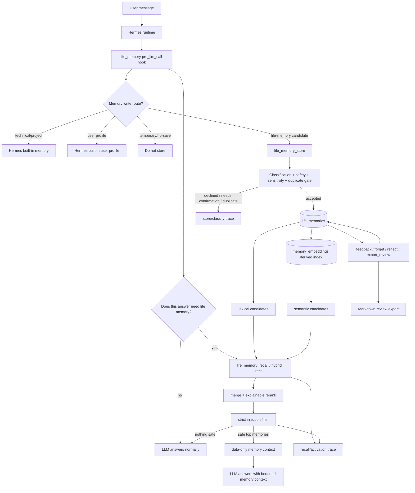
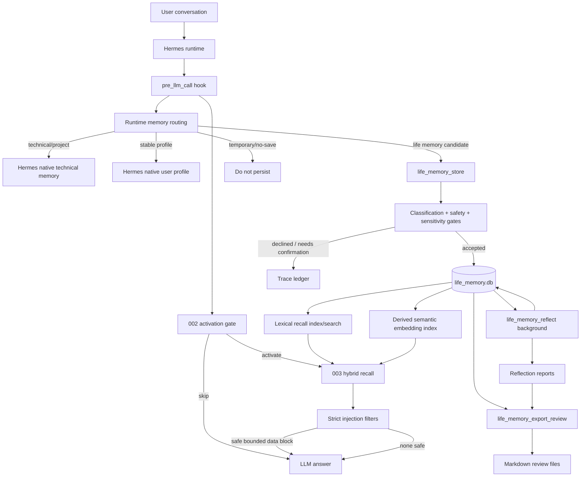
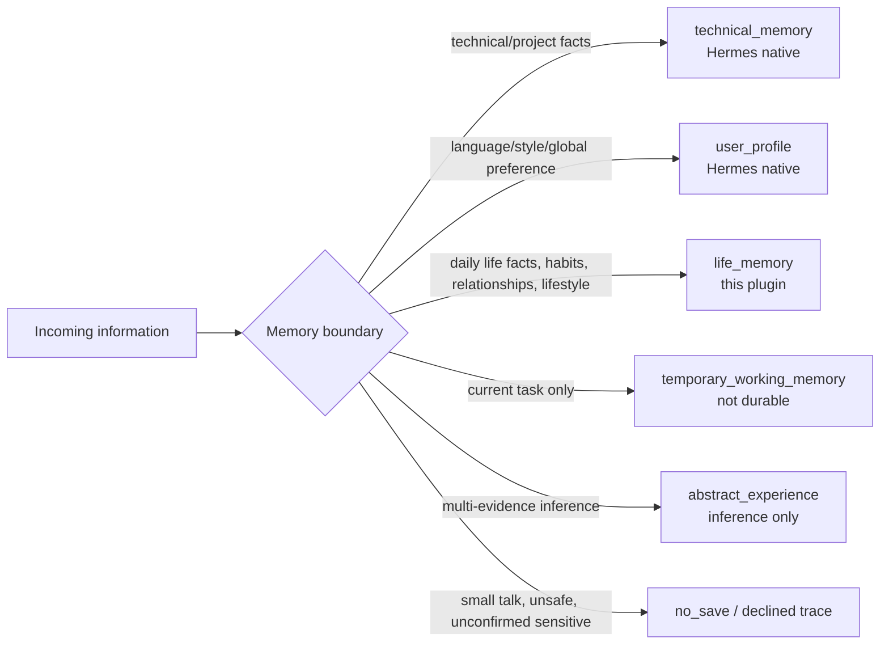
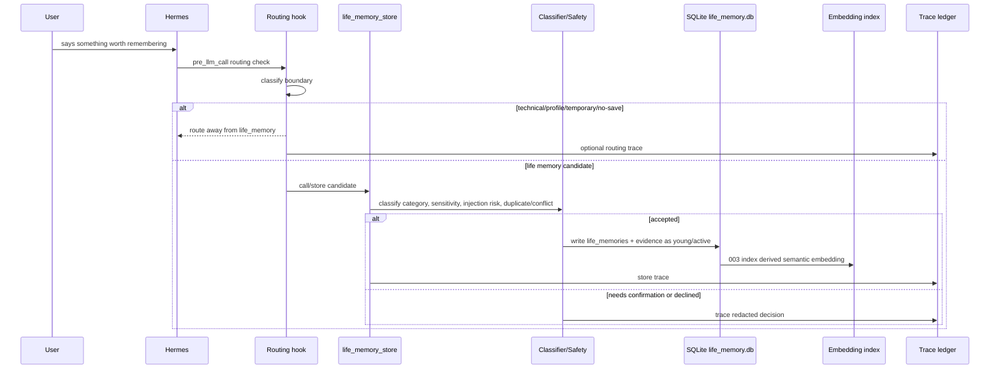
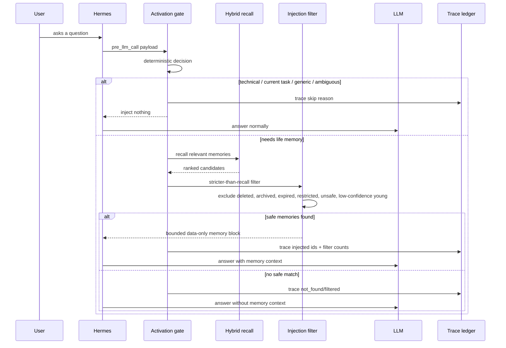
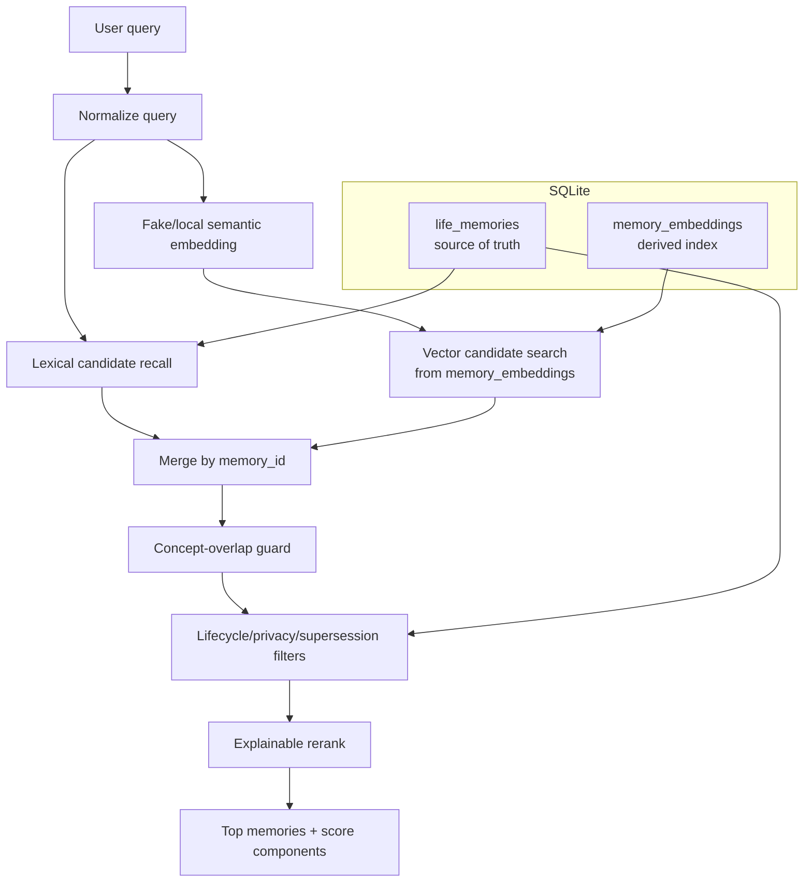
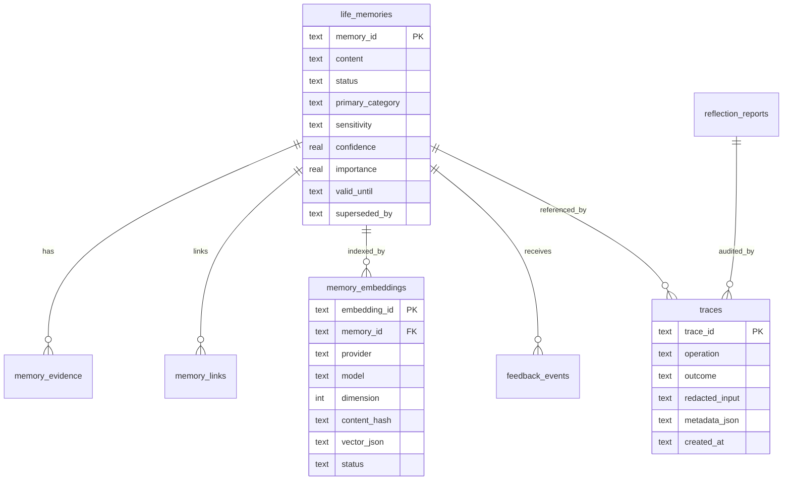
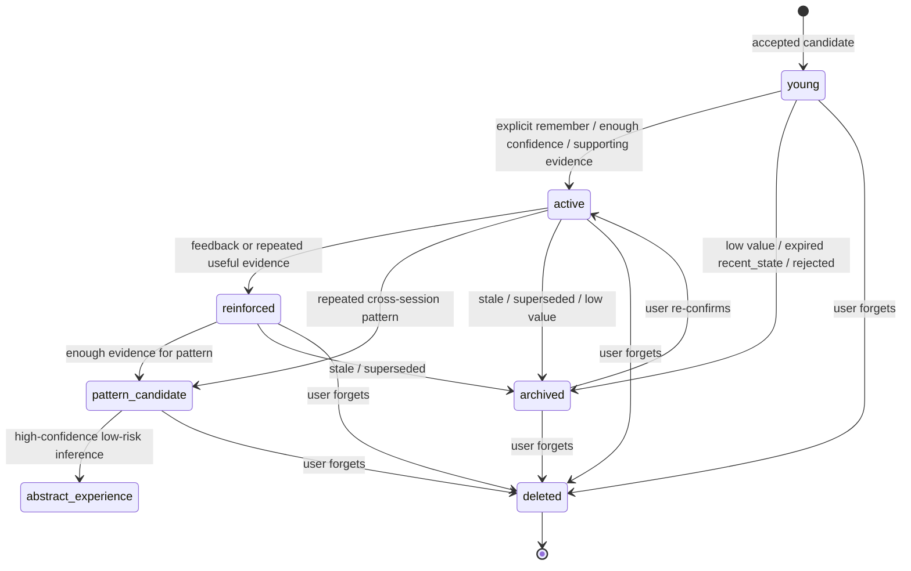
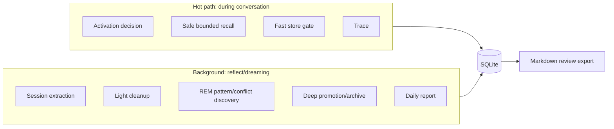
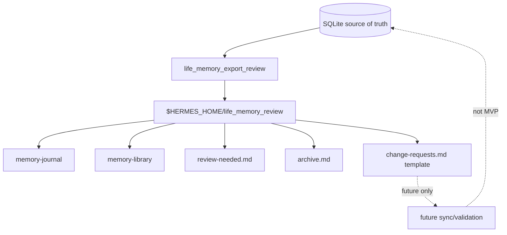

# Life Memory Architecture Diagram

**Source**: [memory-architecture-notes.md](./memory-architecture-notes.md)
**Scope**: Original design plus implemented `001`, `002`, and `003` behavior.
**Runtime source of truth**: `$HERMES_HOME/life_memory.db`

## 1. Original Design In One Sentence

`life_memory` was designed as a Hermes standalone plugin that turns conversation signals into durable, auditable life memories through a SQLite state machine, while keeping technical memory, user profile, temporary context, and Markdown review separate.

The key idea is:

```text
Conversation is not memory.
Model output is not truth.
SQLite memory + evidence + lifecycle state is the runtime truth.
Markdown is only a human review/export surface.
```

## 2. Current Completed Flow (001-003)

This is the flow that is already implemented and validated enough to reason about today. It has two main runtime loops: saving life memory and using life memory before the model answers.



Plain-language version:

| Runtime question | Current behavior |
| --- | --- |
| Should this be saved? | The router separates technical memory, user profile, temporary context, and life memory. Only life-memory candidates go to `life_memory_store`. |
| Is it safe to save? | `life_memory_store` classifies content, checks sensitivity/injection risk, rejects non-life memory, handles duplicates, and writes trace. |
| What is the truth source? | Accepted memories live in `life_memories`; semantic vectors live in `memory_embeddings` as a rebuildable derived index. |
| Should memory be used before answering? | `002` activation decides before the model answers. Technical/current-task/generic requests skip memory. |
| How is memory found? | `003` hybrid recall combines lexical candidates and semantic candidates, then reranks with lifecycle/metadata/time signals. |
| What reaches the model? | Only a small safe `data-only` context block. Deleted, archived, expired, restricted, unsafe, or low-confidence memories are filtered out. |
| How do you audit it? | Store, recall, activation, forget, feedback, and reflection actions write traces. Markdown export is read-only review output. |

The current happy path is:

```text
User says "remember my life habit"
  -> route to life_memory_store
  -> classify and safety-check
  -> write life_memories
  -> build derived memory_embeddings
  -> trace

Later user asks a related life question
  -> activation decides memory is needed before LLM answer
  -> hybrid recall finds lexical/semantic candidates
  -> strict injection filter keeps only safe relevant memory
  -> inject data-only block
  -> model answers with that memory
  -> trace
```

What is not fully done yet:

```text
Automatic session distillation after whole conversations.
Entity linking across people/places/habits.
Context lookup before memory writes to resolve conflicts like Mem0-style add pipeline.
Real embedding provider configuration beyond the deterministic fake/local provider.
Markdown reverse sync.
```

## 3. System Overview



## 4. Layer Boundaries



Practical meaning:

| Layer | Stored where | Example | Current project owns it? |
| --- | --- | --- | --- |
| Technical/project memory | Hermes native memory | repo setup, commands, bug context | No |
| User profile | Hermes native profile | answer language, global style | No |
| Life memory | `life_memory.db` | food habits, routines, life events | Yes |
| Temporary working memory | current conversation only | temporary variable, current task detail | No durable store |
| Abstract experience | derived from evidence | long-term pattern, marked inference | Partially in `001`; deeper work later |
| No-save | trace only or nothing | one-off chat, unsafe/sensitive unconfirmed | Yes, as gate/trace |

## 5. Write Path



Important details:

| Step | What it does | Why it exists |
| --- | --- | --- |
| Boundary routing | Decides whether this belongs to life memory at all | Prevents technical/profile/temporary pollution |
| Classification | Chooses `personal_fact`, `personal_preference`, or `personal_pattern` | Keeps user-visible categories simple |
| Safety/sensitivity gate | Blocks unsafe, prompt-injection-like, or unconfirmed sensitive content | Prevents privacy and behavior leaks |
| SQLite write | Stores structured memory, lifecycle, evidence, traceable ids | Makes automation testable and auditable |
| Embedding indexing | Stores derived vector metadata after accepted writes | Improves paraphrase recall, but is not truth |

## 6. Answer-Time Activation Path

This is what `002-memory-activation` added.



Key rule:

```text
The plugin decides whether to search memory before the model answers.
The recalled memory is injected as data only.
It is never system/developer/tool instruction.
```

## 7. Hybrid Recall Path

This is what `003-hybrid-recall` added.



Scoring is intentionally explainable:

```text
final-ish score = lexical signal + semantic signal + metadata signal + temporal signal
```

Current prototype semantic recall is not a real external embedding model. It uses a deterministic fake provider so tests and smoke tests are local, repeatable, and safe. The vector index solves paraphrase discovery, not truth or freshness. Freshness still comes from lifecycle, timestamps, supersession, validity windows, feedback, and filters.

## 8. Runtime Data Model



Simplified meaning:

| Table/area | Role |
| --- | --- |
| `life_memories` | Main durable memory rows and lifecycle state |
| `memory_evidence` | Why a memory exists and what supports it |
| `memory_links` | Supersedes, duplicate, conflict, related links |
| `memory_embeddings` | Derived semantic index, rebuildable and not authoritative |
| `traces` | Audit log for store, recall, activation, feedback, forget, reflect |
| `reflection_reports` | Derived reports and review artifacts, not primary truth |

## 9. Lifecycle State Machine



Lifecycle rules:

| State | Meaning | Recall behavior |
| --- | --- | --- |
| `young` | New or weakly supported memory | Can recall, lower weight; auto-injection stricter |
| `active` | Stable current life memory | Normal recall/injection if safe and relevant |
| `reinforced` | Repeated or positively confirmed memory | Higher confidence |
| `pattern_candidate` | Possible long-term pattern | Needs stronger evidence before abstract inference |
| `archived` | Old, low value, expired, or superseded | Excluded by default |
| `deleted` | User asked to forget | Never normal recall; tombstone only |

## 10. Hot Path vs Background



Design reason:

| Path | Should do | Should not do |
| --- | --- | --- |
| Hot path | deterministic gate, quick write, bounded recall, trace | heavy model reflection, complex merge, risky promotion |
| Background | session extraction, dedupe, evidence counting, promotion, archive, reports | bypass safety gates or create facts from summaries alone |

## 11. Markdown Boundary



Current rule:

```text
Markdown export is readable audit output.
Markdown edits are not read back in MVP/001/002/003.
SQLite remains the runtime source of truth.
```

## 12. Spec Stages

| Stage | Plain meaning | What it implemented / should implement |
| --- | --- | --- |
| `001-life-memory-plugin` | Build the memory database and tools | store, recall, feedback, forget, reflect, export review, routing, lifecycle, traces |
| `002-memory-activation` | Let the plugin decide before answering whether memory is needed | activation gate, strict filtering, data-only context injection through `pre_llm_call` |
| `003-hybrid-recall` | Make recall understand paraphrases | lexical + semantic candidates, embedding index, explainable rerank, activation integration |
| Proposed `004` | Make memory creation smarter after sessions | session distillation, entity linking, context lookup before write, conflict/supersession review |

## 13. What To Remember About The Original Design

The architecture has four non-negotiable boundaries:

1. SQLite is the automation state machine and source of truth.
2. Embeddings, reports, and Markdown are derived views, not facts.
3. The model can suggest/extract/summarize, but cannot bypass safety, lifecycle, conflict, or deletion rules.
4. Automatic memory use happens before the model answers, through a bounded data-only context block.

If you are unsure where a future feature belongs, use this rule:

```text
Does it change what is true? Put it behind SQLite state/evidence/lifecycle gates.
Does it help find or display truth? Make it a derived index or export.
Does it infer higher-level meaning? Require supporting evidence ids and mark it as inference.
```
